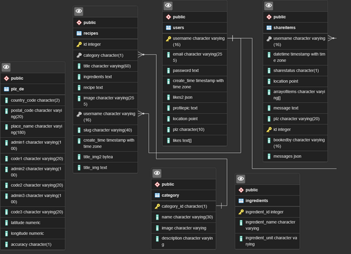

## BACKEND for Share My Food project

<h3>Database/s:</h3>
  &emsp;Live (online) - ElephantSQL   
  &emsp;Production (local) - PostgreSQL, MySQL
 

---

## <i>Deployments:</i>

<h4><u>V2</u></h4>
<h3>- Backend:</h3>

&emsp;<a href="https://smf-backend.onrender.com" target="_blank">https://smf-backend.onrender.com</a>
 
  &emsp;&emsp; <u><i>Note on Database:</i></u>
   
  &emsp;&emsp;<i>Spin up time is over 1 minute on ONRENDER</i>
   
  &emsp;&emsp;- <i>(changed from Heroku because no more free tier).</i>
   
<h3>- Frontend:</h3>
  &emsp;<a href="https://sharemyfood.vercel.app" target="_blank">sharemyfood.vercel.app</a> 

 

<h4><u>V0</u></h4>
<h3>- Backend:</h3>
  &emsp; <a href="https://sharemyfood-backend.herokuapp.com" target="_blank">https://sharemyfood-backend.herokuapp.com</a>
   
<h3>- Frontend:</h3>
  &emsp;<a href="https://final-project-wd020.vercel.app" target="_blank">https://final-project-wd020.vercel.app</a>
   
  &emsp;(Beta) <a href="https://vrwgh-finalprojectwd020.netlify.app" target="_blank">https://vrwgh-finalprojectwd020.netlify.app</a>
   

---

<pre>
Developer:   Victor Wright
Project:     WBS WD#020 Group - Jan 2022
Instructor:  Jorge Paul (WBS Coding School)
Date:        12 Jan 2022
Deployed V1: <a href="https://smf-backend.onrender.com">https://smf-backend.onrender.com</a>
GH Page:     <a href="https://vrw-gh.github.io/sharemyfood-backend/">vrw-gh.github.io/sharemyfood-backend</a>
</pre>